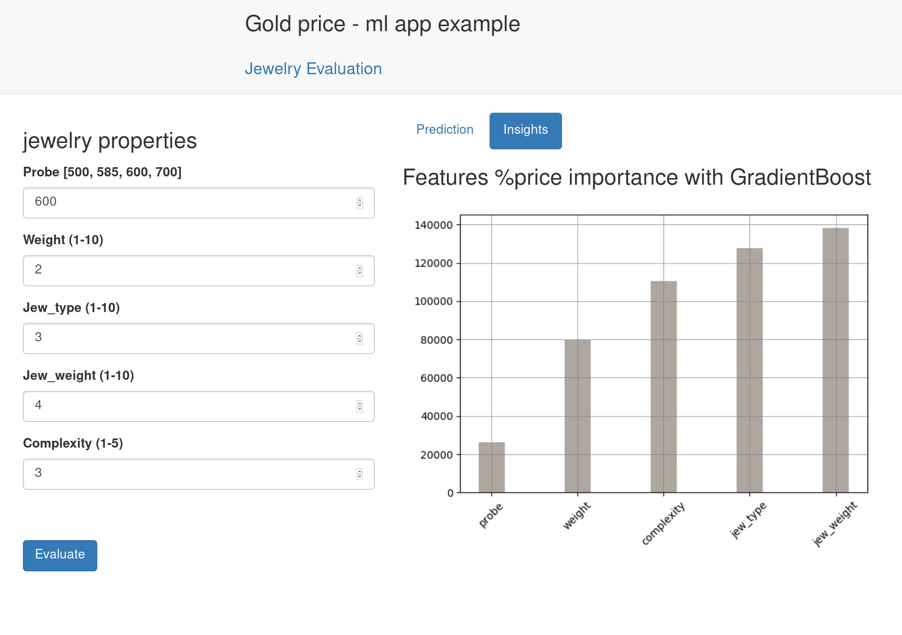

# ml-flask-app

Gold price - ml app example

this is dockerized app that evaluate jewelry prices
with ml algoritm based on emulated data (emulate scrapping system)

it contains several services:

ml_service:  
        emulation of web scrapig - generate data  
        ml use this data - create model and dump it  
        notebook to develop model  

redis:  
        just redis  
    
flask_service:  
        flask app use dumped model  
        and can evaluate new data  
        redis storage of previous results  





## Run application

install docker, docker-compose

clone repository

```bash
docker-compose build
```

```bash
docker-compose up
```
add -d flag to run in background

To see how containers stack running after docker-compose up
```bash
docker-compose ps
```


of course you can run containers separatly  
for example flask service  
or ml service with docker  

```bash
docker build -t ml_service -f Dockerfile_ml_evaluate .
docker run --rm -it -p 8888:8888 ml_service
```

## Model prediction

The model trained with GradientBoostingRegressor on emualated data  
It is simple but powerful model

service contains ipython notebook to work at model  
run from repository  
or with docker command  

```bash
jupyter notebook price_evaluate.ipynb
```


